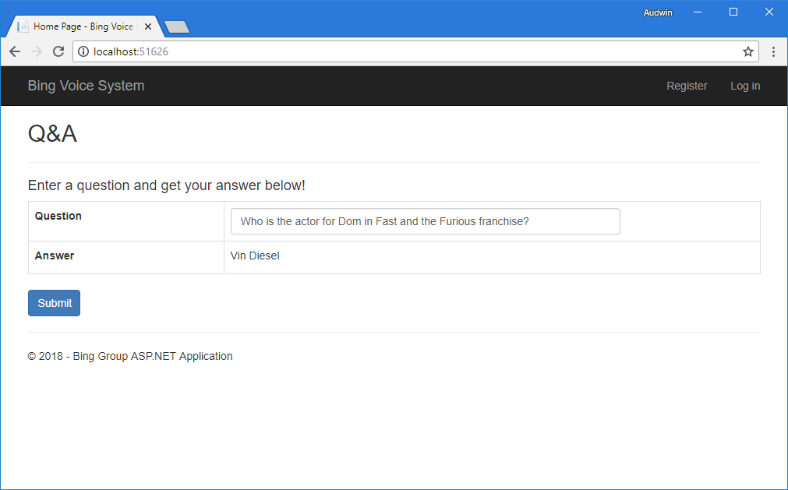

# Bing Voice System

A group project of "Proof of Concept" ASP.NET MVC web application which mocks voice-based conversations as Questions and Answers.

This project was created for **31100 Enterprise Development with .NET** course at UTS.

## Setup

* Right click BingVoiceSystem.WebMVC project > Set as StartUp project.
* Build and run the project.

## Previews

  

  

  

  

  

  

